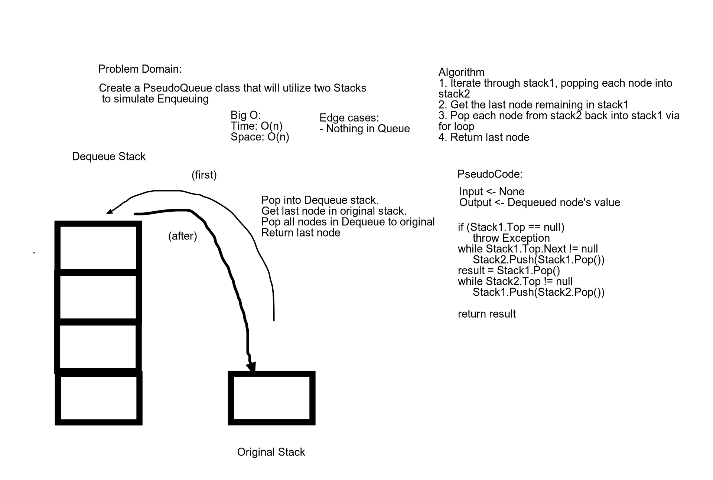

# Queues With Stacks
This program creates a fake queue using two stacks

## Challenge
This challenge is to create a queue utilizing two stacks

## Approach & Efficiency
Unit tests for each functionality for the linked list were created. After 'mapping out' the desired outcomes through unit tests, each function was made. Time complexities for methods are as follows.

* Enqueue() -> O(1) since the method simply adds a node to the front of the queue
* Dequeue() -> O(n) since the operation is performed for every node in the queue

## API
Public methods include:

* Enqueue() -> Adds a node to the "front" of the queue
* Dequeue() -> Moves all nodes to the other stack, gets the last node in the initial stack, then moves all the nodes back to the first stack

## Whiteboard
Whiteboard for 'dequeue' method

## Link To Code
[Link to Code](./QueuesWithStacks/)
