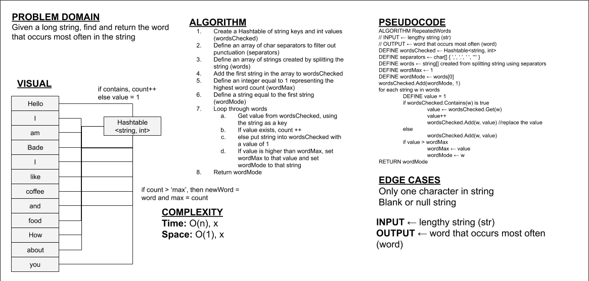

# Repeated Words
This program returns the highest occurring word in a lengthy string

## Challenge
This challenge is to create a program that returns the highest occurring word in a lengthy string

## Approach & Efficiency
Unit tests for each functionality for the linked list were created. After 'mapping out' the desired outcomes through unit tests, each function was made. Time complexities for methods are as follows.

* CheckRepeatedWords() -> O(n) since the method needs to iterate through the whole array

## API
Public methods include:

* CheckRepeatedWords() -> Takes a lengthy string and returns the most often occurring word in that string

## Whiteboard
Whiteboard for CheckRepeatedWords

## Link To Code
[Link to Code](./RepeatedWords/)

