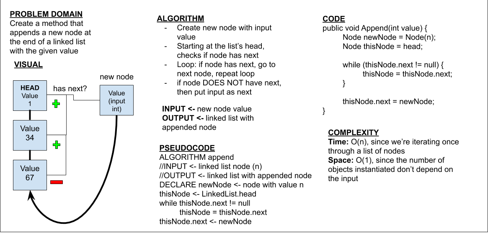

# Singly Linked List
This program creates a simple linked list

## Challenge
This challenge is to create a linked list in a DLL and add functionality for inserting nodes into the library and checking for a specific value in the library.

(Part 2) Add the Append, InsertBefore, and InsertAfter methods.

## Approach & Efficiency
Unit tests for each functionality for the linked list were created. After 'mapping out' the desired outcomes through unit tests, each function was made. Time complexities for methods are as follows.

* Includes() -> O(n) since the method looks through the entire list to find the given value
* Insert() -> O(1) since only one operation is performed
* ToString() -> O(n) since the method constructs a string from each node
* Append() -> O(n) since the method iterates through the entire linked list

## API
Public methods include:

* Includes()
* Insert()
* ToString()
* Append()

## Whiteboard
Whiteboard for 'append' method

## Link To Code
[Link to Code](./LLLibrary/)