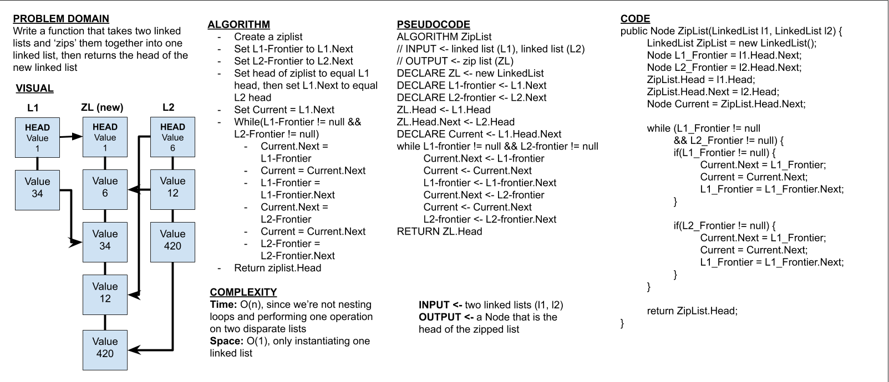

# Zip List
This program zips together two lists

## Challenge
This challenge is to create a function called ZipList that takes two Linked Lists and 'zips' them together into one larger list

## Approach & Efficiency
Unit tests for each functionality for the linked list were created. After 'mapping out' the desired outcomes through unit tests, each function was made. Time complexities for methods are as follows.

* ZipList() -> O(n) since the method iterates through both lists at the same time

## API
Public methods include:

* ZipList()

## Whiteboard
Whiteboard for 'append' method

## Link To Code
[Link to Code](./LLZip.sln)